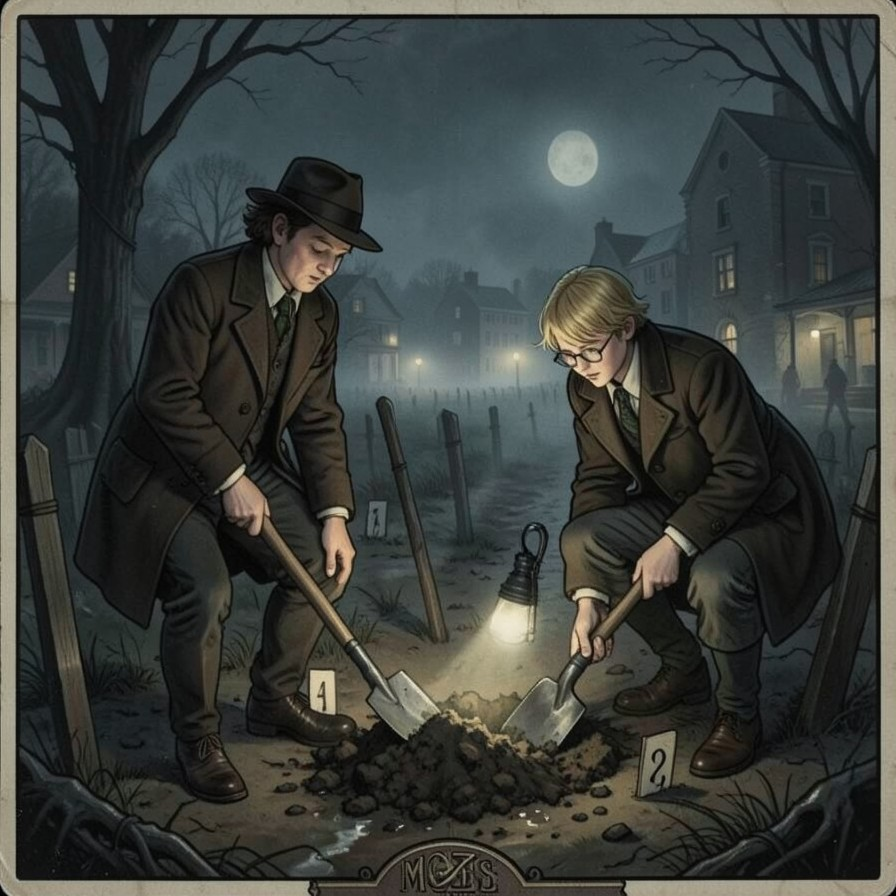

# Herbert West—Reanimator I: From the Dark

A Mansions of Madness (2nd edition) scenario for the [Valkyrie](https://github.com/NPBruce/valkyrie) app, after the first chapter of H. P. Lovecraft's *Herbert West—Reanimator* (1922).

> Arkham, the summer of our third year at the Miskatonic University Medical School. Herbert West has been debarred from his experiments by Dean Halsey himself, but he will not stop: he needs a human subject, and it must be fresh.
>
> Unearth a drowned workman from the potter's field without being seen, carry him to the deserted Chapman farmhouse, and learn what West's solution can do.

| | |
|---|---|
| Investigators | 1–4 |
| Length | 60–90 minutes |
| Difficulty | Medium |
| Components | Mansions of Madness 2nd edition base game. *Beyond the Threshold* is optional: with it, the Specimen uses the Thrall figure, otherwise the Deep One Hybrid. |
| Language | English |

Two acts:
- **The potter's field.** Find the right grave by lantern-light, dig, and put the ground back the way it was, while every gleam raises suspicion.
- **The Chapman farmhouse.** Inject the solution and wait. You may also piece together West's torn formula, a picture puzzle.

## Play

Once the scenario is listed in Valkyrie's download screen, download it there. Until then, or to play this exact version:
1. Download `HerbertWestReanimator.valkyrie`.
2. Place it in Valkyrie's download folder:
   - macOS/Linux: `~/.config/Valkyrie/Download/`
   - Windows: `%APPDATA%\Valkyrie\Download\`

## Repository layout

| Path | What it is |
|---|---|
| `HerbertWestReanimator.valkyrie` | The scenario package Valkyrie downloads |
| `HerbertWestReanimator.ini` | Its listing: title, synopsis, description, authors and `version` |
| `Intro.jpg` | The picture shown in the scenario list |
| `source/` | The scenario's editable files, as in Valkyrie's editor folder |

To work on the scenario:
1. Copy `source/` to your Valkyrie editor folder as `HerbertWestReanimator`:
   - macOS/Linux: `~/.config/Valkyrie/MoM/Editor/`
   - Windows: `%APPDATA%\Valkyrie\MoM\Editor\`
2. Open it in the editor.
3. Rebuild with **Tools → Create Package**, which also updates `version` in the `.ini`.

Fixes and translations are welcome as pull requests.

## Credits

- Story and text adapted from H. P. Lovecraft's *Herbert West—Reanimator*, which is in the public domain.
- Scenario design, text and puzzles: Thijs Hakkenberg.
- Built with [valkyrie-mom](https://github.com/thijs-hakkenberg/ValkyrieMCP), an AI-assisted scenario editor for Valkyrie.
- Illustrations generated with FLUX.2 [klein] 4B.
- Mansions of Madness is a trademark of Fantasy Flight Games. This is an unofficial fan scenario, not affiliated with or endorsed by Fantasy Flight Games.
